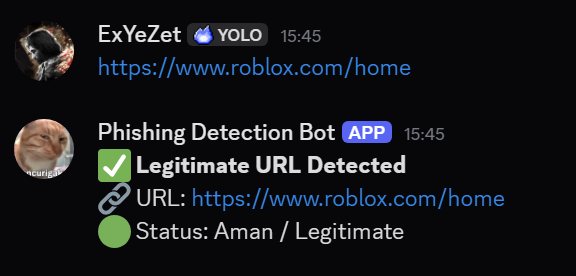
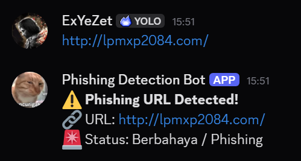
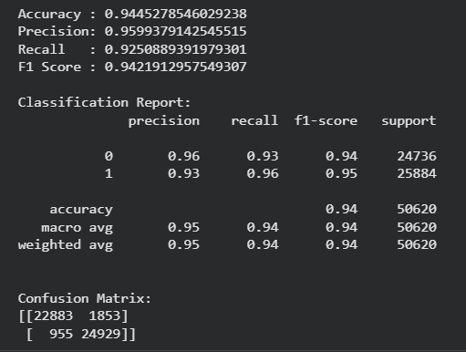

# 🔐 URL Phishing Detection System with Random Forest + Discord Bot


A real-time phishing URL detection system powered by Machine Learning, integrated directly into Discord for instant security analysis.

---

## 🎥 Demo Preview

### ✅ Legitimate URL Detection


### ⚠️ Phishing URL Detection


---

## 🚀 Features

- Detect phishing URLs using a Random Forest model
- Real-time URL classification through a Discord Bot
- Automatic model download from Google Drive
- URL-based feature extraction
- Binary classification: Phishing or Legitimate
- Simple and lightweight implementation for real-time usage

---

## ⚙️ How It Works

1. A user sends a URL in a Discord channel
2. The bot extracts the URL using regular expression
3. The URL is converted into structural features
4. The Random Forest model predicts whether the URL is phishing or legitimate
5. The bot sends the classification result back to the Discord channel

---

## 🧠 Model Performance

The Random Forest model was evaluated using standard classification metrics.

| Metric | Score |
|---|---:|
| Accuracy | 94.45% |
| Precision | 95.99% |
| Recall | 92.51% |
| F1 Score | 94.22% |

The model shows strong performance with balanced precision and recall, making it suitable for real-time phishing URL detection.

---

## 📊 Model Evaluation



---

## 🛠️ Tech Stack

- Python
- Scikit-learn
- Pandas
- NumPy
- Joblib
- Gdown
- Discord.py
- Google Drive

---

## 📂 Project Structure

```text
.
├── bot.py
├── predict.py
├── requirements.txt
├── Notebook/
│   └── malicious_phish.csv
├── Screenshots/
│   ├── bot_legitimate.png
│   ├── bot_phishing.png
│   ├── bot_running.png
│   ├── model_evaluation.png
│   └── Multi URL Testing.png
└── README.md
```

---

## ⚠️ Model File

The trained model file:

```text
phishing_model.pkl
```

is **not included** in this repository due to GitHub file size limitations.

The model will be automatically downloaded from Google Drive when running the project.

---

## ⚙️ Installation

Clone the repository:

```bash
git clone https://github.com/ExYeZett/url-phishing-detection-random-forest
cd url-phishing-detection-random-forest
```

Install dependencies:

```bash
pip install -r requirements.txt
```

---

## 🔑 Environment Setup

Create a `.env` file in the project root directory:

```env
DISCORD_BOT_TOKEN=YOUR_DISCORD_BOT_TOKEN
```

⚠️ Never expose your Discord Bot Token publicly. Always store it in environment variables.

---

## ▶️ Run the Discord Bot

```bash
python bot.py
```

If successful, the terminal will show that the bot has logged in and connected to Discord.

---

## 🧪 Example Predictions

### Legitimate URLs

```text
https://www.google.com/              → Legitimate
https://www.telkomuniversity.ac.id/  → Legitimate
https://www.roblox.com/home          → Legitimate
https://web.whatsapp.com/            → Legitimate
```

### Phishing URLs

```text
http://lpmxp2084.com/                              → Phishing
http://secure-login-verification.example.com/login → Phishing
http://paypal-security-check.example.com           → Phishing
```

---

## 🧾 Sample Bot Output

### Legitimate URL

```text
✅ Legitimate URL Detected
🔗 URL: https://www.roblox.com/home
🟢 Status: Aman / Legitimate
```

### Phishing URL

```text
⚠️ Phishing URL Detected!
🔗 URL: http://lpmxp2084.com/
🚨 Status: Berbahaya / Phishing
```

---

## 📌 Notes

- The model uses URL-based structural features only
- Accuracy is not perfect, so critical URLs should still be manually validated
- The Discord bot token must be stored securely using `.env`
- The trained model is downloaded automatically from Google Drive on first run

---

## 🔮 Future Improvements

- Add domain reputation checking
- Add WHOIS-based feature extraction
- Add blacklist API integration
- Deploy the bot to a cloud server
- Add detection logs and database storage
- Build a web dashboard for URL analysis

---

## 👨‍💻 Author

**Rizky Hadi**  
GitHub: [ExYeZett](https://github.com/ExYeZett)
